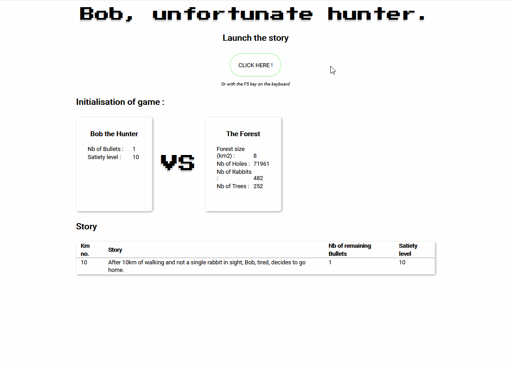

# Bob_Unfortunate_Hunter

## Description

Training with PHP - Script generating the story of a hunter looking for rabbit in the forest.

The script will randomly generate a forest containing X rabbits, with X trees and X holes.
The hunter and the rabbits move through the forest.
Each time the hunter detects a rabbit, the script generates the hunting story.

## How it work




## Prerequisites

You'll need a working text editor to read this document.

```
VS Code or Atom would work just fine.....
```

## Built with

- [HTML5](https://developer.mozilla.org/es/docs/HTML/HTML5)
- [CSS3](https://developer.mozilla.org/en-US/docs/Archive/CSS3)
- [PHP](https://www.php.net/)

